# PAUMarket Recommender System - Matris, Matematik ve Çıktı Savunma Notu

Bu dosya, tez hocasının öneri sistemiyle ilgili "matris nasıl oluşturuldu, hangi matematiksel model kullanıldı, ağırlıklar neye göre verildi ve sistemden hangi çıktılar alınabiliyor?" sorularına hazır cevap verebilmek için hazırlanmıştır.

## 1. Kısa Savunma Özeti

PAUMarket öneri sistemi iki katmanlı çalışır:

1. **Canlı kişiselleştirme katmanı (Backend):** Kullanıcının anlık görüntüleme, favori, mesaj ve anlaşma sinyallerini hemen kullanır. Yeniden eğitim beklemeden ana sayfadaki "Sana Özel Öneriler" alanını günceller.
2. **Model tabanlı katman (Python/FastAPI):** PAUMarket etkileşim export'u ile LightFM tabanlı hibrit model eğitir. Yeterli etkileşim geçmişi olan kullanıcılarda collaborative + kategori özellikli sıralama üretir.

Bu ayrım önemlidir: Bir kullanıcı favori yaptığında veya mesaj attığında sistem hemen tepki verebilir; fakat daha derin "bu kullanıcıya benzeyenler neleri beğendi?" bilgisinin modele yansıması için yeniden eğitim gerekir.

## 2. Veri Akışı

Üretim akışı şu şekildedir:

```mermaid
flowchart LR
    A["Frontend\nGörüntüleme, favori, mesaj, anlaşma"] --> B["C# Backend\nInteraction tablosu"]
    B --> C["Recommender Export CSV\nuser_id, listing_id, event, timestamp, weight"]
    C --> D["Python Preprocessor\nID mapping + train/test split"]
    D --> E["Sparse Interaction Matrix\nR: user x listing"]
    E --> F["LightFM Hybrid Model\nWARP ranking loss"]
    F --> G["original_item_id = PAUMarket Listing.Id"]
    G --> H["Backend doğrular\naktif/onaylı/satılmamış ilan"]
    H --> I["Frontend\nSana Özel Öneriler"]
```



Backend export dosyaları:

- `GET /api/recommender-export/interactions`
- `GET /api/recommender-export/listings`

Bu endpoint'ler admin korumalıdır. Böylece model eğitim verisi normal kullanıcıya açılmaz.

## 3. Interaction Matrisi Nasıl Oluşturuluyor?

Modelin ana girdisi kullanıcı-ilan etkileşim matrisidir:

```text
R ∈ R^(|U| x |I|)
```

Burada:

- `U`: kullanıcı kümesi
- `I`: ilan kümesi
- `R[u, i]`: kullanıcı `u` ile ilan `i` arasındaki ilgi gücü

Backend her etkileşimi CSV'ye şu formatta verir:

```csv
user_id,listing_id,event,timestamp,weight
1005,2102,favorite,2026-04-27T09:12:00Z,3.0
1005,2200,view,2026-04-27T09:15:00Z,1.0
```

Python preprocessor bu ID'leri modelin kullanacağı sıralı index'lere çevirir:

```text
user_id    -> user_idx
listing_id -> item_idx
item_idx   -> original Listing.Id
```

Bu mapping kritik bir savunma noktasıdır: Model kendi içinde `0..N` index'leriyle çalışır, fakat backend'e dönerken mutlaka gerçek PAUMarket `Listing.Id` değeri kullanılır.

## 4. Etkileşim Ağırlıkları

PAUMarket'te klasik e-ticaret sepet akışı yoktur. Bu nedenle RetailRocket'taki "addtocart" davranışı bizde "anlaşma isteği / satın alma niyeti" olarak yorumlanır. PAUMarket'in gerçek davranış ağırlıkları backend'de tek kaynak olarak hesaplanır:

| Event | Ağırlık | Anlam |
|---|---:|---|
| `view` | `1.0` | İlanı görmek, zayıf ilgi |
| `message` | `2.0` | Satıcıyla iletişime geçmek |
| `favorite` | `3.0` | Bilinçli ilgi, tekrar bakma niyeti |
| `deal_request` | `4.0` | Anlaşma isteği, güçlü satın alma niyeti |
| `deal_accepted` | `4.5` | Satıcı tarafından kabul edilen niyet |
| `purchase` | `5.0` | Tamamlanmış satış, en güçlü pozitif sinyal |

Matris mantığı:

```text
R[user_idx, item_idx] = kullanıcının ilana verdiği implicit feedback gücü
```

Aynı kullanıcı-ilan-event tekrar ederse en son kayıt tutulur. Farklı event türleri aynı user-listing hücresinde birikerek daha güçlü ilgi sinyali gibi davranır.

## 5. Train/Test Split ve Data Leakage Önlemi

PAUMarket preprocessor akışı:

1. CSV yüklenir.
2. Event isimleri normalize edilir.
3. Backend'den gelen `weight` kolonu okunur.
4. Duplikatlar temizlenir.
5. Zaman bazlı `80/20` train/test split yapılır.
6. Sparse filtreleme sadece train evreni üzerinde yapılır.
7. Test seti train'de görülen kullanıcı/ilan evrenine hizalanır.

Bu sıra bilinçli seçildi. Önce split, sonra train tabanlı filtreleme yapıldığı için gelecek test etkileşimleri modelin eğitim evrenini belirlemez. Bu, offline metriklerin yapay olarak şişirilmesini engeller.

Kod karşılığı:

- `/Users/hasantogmus/Desktop/pau-market/recommender/app/data/paumarket_preprocessor.py`
- `TRAIN_TEST_SPLIT_RATIO = 0.8`

## 6. Sparse Matris

Etkileşim matrisi çok seyrektir. Her kullanıcı her ilanı görmez. Bu nedenle dense matris yerine `scipy.sparse.coo_matrix` kullanılır:

```python
coo_matrix((weights, (user_idx, item_idx)), shape=(n_users, n_items))
```

Örnek metrik çıktısına göre mevcut eğitim koşusunda:

```text
n_users        : 103
n_items        : 214
n_interactions : 1946
sparsity       : 91.3211%
```

Yani matrisin yaklaşık `%91.3` kısmı boştur. Sparse matris kullanmak hem RAM hem de eğitim performansı için gereklidir.

## 7. Item Feature Matrisi

LightFM sadece kullanıcı-ilan etkileşimini değil, ilan özelliklerini de kullanır. Bizde item feature matrisi şu şekilde kurulur:

```text
F_item = [I_items | OneHot(category)]
```

Yani her ilan iki tip özellik taşır:

1. **Identity feature:** İlanın kendi kimliği.
2. **Category feature:** Elektronik, Giyim, Ev Eşyası gibi kategori bilgisi.

Bu sayede model sadece "kim neye tıkladı" bilgisini değil, "hangi kategoriye ilgi var" bilgisini de öğrenir.

Kod karşılığı:

- `/Users/hasantogmus/Desktop/pau-market/recommender/app/models/hybrid.py`

## 8. Kullanılan Model: LightFM + WARP

Model:

```text
LightFM Hybrid Model
loss = WARP
no_components = 64
learning_rate = 0.05
epochs = 30
```

LightFM, kullanıcı ve ilanları latent vektör uzayında temsil eder. Basit anlatımla skor şu fikre dayanır:

```text
score(u, i) = user_vector(u) · item_vector(i) + bias terms
```

Hibrit durumda item vektörü sadece item ID'den değil, item feature matrisinden de beslenir. Bu nedenle kategori bilgisi de skoru etkiler.

WARP (Weighted Approximate-Rank Pairwise) loss, explicit puan tahmininden çok sıralama kalitesini optimize eder. Yani modelin amacı "bu ürüne 4.2 puan verir" demekten ziyade:

```text
Kullanıcının ilgilendiği ilanlar, ilgilenmediği ilanlardan daha yukarıda sıralansın.
```

Bu PAUMarket için doğrudur; çünkü elimizde Netflix gibi 1-5 yıldız puanı yok, implicit feedback vardır.

## 9. Öneri Üretme

Eğitimden sonra model bir kullanıcı için tüm ilanlara skor verir:

```text
scores = model.predict(user_idx, all_item_idx)
```

Sonra:

1. Kullanıcının zaten etkileşim verdiği ilanlar maskelenir.
2. Skoru en yüksek `N` ilan seçilir.
3. `item_idx` tekrar gerçek `Listing.Id` değerine çevrilir.
4. Backend bu ID'leri kontrol eder:
   - İlan onaylı mı?
   - Satılmamış mı?
   - Kullanıcının kendi ilanı değil mi?
   - Hala veritabanında var mı?

Bu son kontrol, ID uyumsuzluğu veya silinmiş ilan riskine karşı güvenlik katmanıdır.

## 10. Cold Start Yaklaşımı

Sistemde cold-start eşiği:

```text
COLD_START_THRESHOLD = 5
```

Bir kullanıcının train setinde 5'ten az etkileşimi varsa Python model canlı PAUMarket ilan ID'si üretmeye zorlanmaz. Bunun yerine `backend_fallback` döner. Backend şu kaynaklarla öneriyi doldurur:

1. Anlık canlı etkileşimler: görüntüleme, favori, mesaj, anlaşma.
2. Onboarding tercihleri.
3. Kategori/condition benzerliği.
4. En yeni veya popüler onaylı ilanlar.

Bu karar özellikle iki veri seti savunmasında önemlidir: Mercari veya RetailRocket ID'leri PAUMarket ID'siymiş gibi kullanılmaz.

## 11. İki Veri Setini Nasıl Savunuruz?

Hocanın "iki veri setinin ID'leri uyuşmaz" eleştirisi teknik olarak doğrudur. Bizim savunmamız şu olmalı:

> Biz iki veri setini doğrudan ID seviyesinde birleştirmiyoruz. RetailRocket/PAUMarket davranış matrisi kullanıcı-ilan etkileşim mantığını test etmek için, Mercari ise C2C ürün metni/kategori yapısını NLP benchmark'ı olarak kullanılıyor. Canlı PAUMarket önerilerinde backend'e sadece PAUMarket `Listing.Id` dönmesine izin veriyoruz.

Yani yanlış olan şey:

```text
Mercari item_id = PAUMarket Listing.Id gibi davranmak
```

Bizim yaptığımız doğru ayrım:

```text
Davranış verisi -> interaction matrix / ranking modeli
Metin verisi    -> content-based NLP benchmark
Canlı sistem    -> PAUMarket Listing.Id ile doğrulanmış sonuç
```

Bu nedenle iki veri seti "tek ürün evreniymiş" gibi karıştırılmıyor. Ayrı rolleri var.

## 12. Mevcut Çıktı Kanıtları

Recommender health çıktısı:

```json
{
  "status": "healthy",
  "models_loaded": true,
  "model_info": {
    "hybrid_model": "LightFM Hybrid (WARP)",
    "n_users": 12,
    "n_items": 53
  }
}
```

Metrics çıktısından özet (14 Mayıs 2026 pilot veri koşusu):

```text
dataset_summary.source          = paumarket
n_users                         = 12
n_items                         = 53
n_raw_events                    = 251
n_interactions                  = 132
n_train                         = 111
n_test                          = 21
split_strategy                  = user_temporal_holdout
aggregation_strategy            = max_weight_per_user_listing
sparsity_percent                = 79.2453
raw_event_distribution.view     = 123
raw_event_distribution.favorite = 78
raw_event_distribution.message  = 25
raw_event_distribution.deal_req = 13
raw_event_distribution.accepted = 12
content_based category P@5      = 0.93
popularity_baseline Precision@5 = 0.066667
popularity_baseline HitRate@5   = 0.250000
hybrid_lightfm Precision@5      = 0.150000
hybrid_lightfm Recall@5         = 0.416667
hybrid_lightfm NDCG@5           = 0.307267
hybrid_lightfm HitRate@5        = 0.666667
hybrid_lightfm StrongP@5        = 0.133333
hybrid_lightfm StrongHR@5       = 0.583333
hybrid_lightfm Precision lift   = +124.9989%
hybrid_lightfm HitRate lift     = +166.6668%
```

Önemli not: Bu koşuda LightFM metriği 12 warm test kullanıcısı üzerinde hesaplandı. Pilot veri hâlâ küçük olduğu için bu sonuçlar "nihai ürün başarısı" iddiası değil; gerçek PAUMarket etkileşimlerinden export -> train -> evaluate pipeline'ının çalıştığını ve LightFM'in popularity baseline'a göre daha iyi sıralama ürettiğini gösteren kanıttır. WARP tabanlı LightFM modeli ranking optimizasyonu yaptığı için posterde ana metrik olarak Precision@5, Recall@5, NDCG@5 ve HitRate@5 gösterilmeli; RMSE ikincil/yardımcı metrik olarak anlatılmalıdır.

## 13. Hocaya Gösterilebilecek Endpoint'ler

Docker ayaktayken:

```bash
curl -s http://localhost:8000/health
curl -s http://localhost:8000/metrics
curl -s "http://localhost:8000/recommend/by-user-id/1005?n=5"
```

Backend tarafında login token ile:

```bash
GET http://localhost:5251/api/recommendations/hybrid?count=8
```

Admin token ile eğitim:

```bash
POST http://localhost:8000/train?source=paumarket
Header: X-Recommender-Admin-Token: <token>
```

## 14. Beklenen Soru-Cevaplar

### Soru: Matrisi nasıl oluşturdunuz?

Kullanıcıları satır, ilanları sütun yaptık. Her user-listing hücresine görüntüleme, favori, mesaj, anlaşma isteği ve satın alma gibi implicit feedback sinyallerinden gelen ağırlıkları koyduk. Matris sparse olduğu için `coo_matrix` kullandık.

### Soru: Neden yıldız puanı yerine implicit feedback?

PAUMarket'te kullanıcı ürünlere 1-5 puan vermiyor. Davranışları ilgi sinyali olarak kullanmak daha doğru: favori yapmak, mesaj atmak veya anlaşma istemek gerçek niyet gösteriyor.

### Soru: Favori neden görüntülemeden daha yüksek ağırlıklı?

Görüntüleme bazen meraktan olabilir. Favori ise kullanıcının ilanı saklamak veya daha sonra dönmek istediğini gösterir. Bu nedenle `view=1`, `favorite=3` verildi.

### Soru: Satış neden en yüksek ağırlıklı?

Satış tamamlanmış davranıştır. Sadece ilgi değil, gerçek tercih kanıtıdır. Bu nedenle `purchase=5` ile en güçlü pozitif sinyal yapılmıştır.

### Soru: Sepet yoksa RetailRocket'taki addtocart neye denk geliyor?

PAUMarket'te sepet yerine anlaşma isteği vardır. Bu nedenle addtocart mantığı "kullanıcı satın alma niyetini güçlü şekilde belli etti" anlamına gelen `deal_request` davranışına karşılık gelir.

### Soru: İki veri seti ID uyuşmazsa neden problem olmuyor?

Canlı öneride yabancı veri seti ID'si PAUMarket ilanı gibi kullanılmıyor. Python model PAUMarket verisiyle eğitildiğinde `item_idx -> Listing.Id` mapping'i vardır. Mercari ise sadece content/NLP benchmark'ı olarak ayrıdır.

### Soru: Yeniden eğitim otomatik mi?

Şu an sistemde eğitim endpoint'i hazır ve admin token ile tetiklenebilir. Tez demosu için manuel tetikleme yeterli; production senaryosunda bu endpoint gece belirli aralıklarla cron job ile çalıştırılabilir.

### Soru: Bir kullanıcı favori yapınca hemen öneriler değişiyor mu?

Evet, backend canlı kişiselleştirme katmanı yeni etkileşimi anında okur ve "Sana Özel Öneriler" alanını yeniler. Python modelin latent vektörlerinin kalıcı olarak değişmesi ise sonraki yeniden eğitimde olur.

### Soru: Kullanıcının kendi ilanı önerilir mi?

Hayır. Export ve backend önerisi, kullanıcının kendi ilanlarını filtreler. Bu hem veri kalitesi hem de kullanıcı deneyimi için gereklidir.

### Soru: Satılmış ilan önerilir mi?

Canlı öneride satılmış ilanlar normal alıcıya önerilmez. Satılmış ilanlar satıcı profili ve güven/yorum geçmişi için görünebilir, fakat aktif satın alma önerisi olarak kullanılmaz.

## 15. Sınırlılıklar ve Dürüst Savunma

Bu sistemin güçlü tarafı mimaridir: veri toplama, ağırlıklandırma, sparse matris, LightFM eğitimi, backend doğrulaması ve cold-start fallback'i uçtan uca vardır.

Sınırlılıklar:

1. Pilot veri az olduğunda metrikler düşük veya dengesiz olabilir.
2. Gerçek akademik başarı için daha fazla PAUMarket kullanıcı etkileşimi gerekir.
3. Yeniden eğitim şu an otomatik zamanlayıcıya bağlı değil; endpoint hazır, cron eklenebilir.
4. Mercari content modeli canlı PAUMarket ID'si döndürmez; benchmark ve NLP savunması için ayrıdır.

Savunma cümlesi:

> Bu tezde asıl katkımız, PAUMarket'e uygun implicit feedback ağırlıklarıyla sparse interaction matrisi kurup, LightFM WARP modeliyle ranking üretmek ve ID uyumsuzluğu/cold-start gibi gerçek hayat problemlerini backend doğrulaması ve fallback katmanıyla güvenli hale getirmektir.
